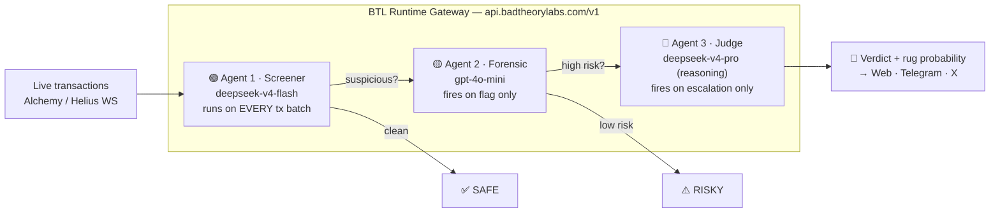

<div align="center">
  

  # BTL Radar

  **Three agents. One gateway. Persistent Memory. Zero rugs.**

  Real-time token security intelligence built on the [BTL Runtime](https://runtime.badtheorylabs.com) and powered by [RetainDB](https://retaindb.com).
  Paste any EVM or Solana contract address and watch three cascading AI agents screen transactions,
  reason about anomalies, and deliver a plain-English verdict.

  
  
  
  
  

  Built for the **BTL Runtime Hackathon** · July 3–5, 2026

</div>

---

## How it works

You paste a contract address. The radar starts immediately. Every transaction flows through a
three-tier agent cascade — each tier routed through the BTL gateway, each tier more expensive
than the last, and each tier firing **only when the one below escalates**.



| Agent | Job | Model (via BTL) | Cost Profile |
|---|---|---|---|
| 🟢 **Screener** | Flag volume spikes, dev-wallet moves, liquidity shifts, gas anomalies | `deepseek-v4-flash` | Free tier (direct) |
| 🟡 **Forensic** | Wallet history, deployer identity, known rug-pattern matching | `gpt-4o-mini` | Mid-tier OpenRouter billing |
| 🔴 **Judge** | Plain-English verdict + rug probability score + alert copy | `deepseek-v4-pro` deep-reasoning pass | Free tier (direct) |

The scan pipeline lives in [`src/app/api/scan/route.ts`](src/app/api/scan/route.ts); the single
BTL client every agent goes through is [`src/lib/btl.ts`](src/lib/btl.ts).

---

## RetainDB Integration (Persistent Agent Memory)

A security system is only as good as what it remembers. We integrated the **RetainDB v5 SDK** to serve as the persistent agent memory layer.

* **Scan-to-Scan Delta:** When a contract is scanned, the result is serialized and stored via `db.remember()`, scoped to the contract address.
* **Risk Trend Detection:** On subsequent scans, the agent pulls previous records using `db.user(id).listMemory()` to calculate the **Risk Trend** (e.g. `INCREASING` or `DECREASING`) and risk delta.
* **UI Banner:** A smart warning banner alerts users if risk has climbed (e.g., "⚠️ Risk increased by 14% since last scan 3 days ago. Previously SAFE.").

---

## Why the BTL Runtime is the Product

This architecture is **economically impossible without a routing gateway**.

The screener processes hundreds of transactions per session. Routing every transaction block directly to a frontier reasoning model would cost hundreds of dollars a day. BTL solves this:

1. **Intelligent Tiering:** High-volume transaction batches are screened by `deepseek-v4-flash` (covered under BTL's free grant).
2. **Selective Escalation:** The expensive forensic and reasoning judge passes (`gpt-4o-mini` / `deepseek-v4-pro`) only execute when a genuine anomaly is flagged.
3. **Optimized Cost Widget:** Live cost tracking is shown in the dashboard's cost widget. By utilizing BTL's `x-btl-customer-charge` headers, we calculate exact actual vs. benchmark costs.

Typical full cascade (screen → forensics → verdict): **~$0.0476 benchmark vs $0.0024 actual (95% LLM Cost Saved).**

---

## Resiliency and Scaling Fixes (Hackathon Polish)

* **Fetch Retries with Exponential Backoff:** Network glitches resolving `api.badtheorylabs.com` will not crash scans. `callBTL` automatically retries up to 3 times on request failure.
* **WebSocket Batch Buffering:** To prevent 100+ API calls per minute from the Alchemy/Helius WebSocket firehose, transactions are buffered for 5 seconds and scanned as a single batch.
* **Feed Auto-Capping & Pause:** For high-volume contracts (like USDC on Solana), the transaction feed automatically caps at 50 captured items, pausing the SSE connection to save token consumption.
* **Desktop Scroll Constraining:** Added `min-h-0` flex columns across all dashboard elements so that pagination controls and verdicts stay visible on desktop, scrolling text cleanly inside card wrappers.
* **EVM & SOL Mock Fallback:** If Helius or Alchemy API connections fail to receive live transaction events for 10 seconds, the client automatically falls back to a simulated mock feed so the user is never stuck.

---

## Quick Start

```bash
git clone https://github.com/TheWeirdDee/BtlRadar
cd BtlRadar
npm install
cp .env.example .env.local   # fill in your keys
npm run dev                  # http://localhost:3000
```

Then open **`/app?demo=true`** for the guided demo (mock feed, simulated memory delta), or **`/app`** and
paste a real contract address for a live three-agent scan.

### Environment Variables

```env
# BTL Runtime Key (Dashboard: runtime.badtheorylabs.com)
BTL_API_KEY=gw_divineis_xxxxxxxxxxxxx

# RetainDB Key (Dashboard: retaindb.com)
RETAINDB_API_KEY=wsk_0330e4da1xxxxxxxx

# Supabase Fallback Database
NEXT_PUBLIC_SUPABASE_URL=https://xxxx.supabase.co
SUPABASE_SERVICE_KEY=eyJhbGciOiJIUzI1NiI...

# Chain feeds
ALCHEMY_API_KEY=JH7WmoNd9zfnq...
HELIUS_API_KEY=2e66d5f1-809c...
```

---

## Project Structure

```
├── src/
│   ├── app/
│   │   ├── page.tsx              # Landing page
│   │   ├── app/                  # Radar dashboard
│   │   └── api/scan/route.ts     # Three-agent cascade pipeline
│   ├── components/               # Radar columns, verdict box, cost widget…
│   └── lib/
│       ├── btl.ts                # BTL Runtime client (with API retry backoff)
│       ├── alchemy.ts helius.ts  # Chain data feeds
│       └── memory.ts             # RetainDB v5 & Supabase persistence
├── telegram-bot/                 # Telegram bot client
├── x-bot/                        # X bot client
```

---

## Hackathon Submission

- **Event:** BTL Runtime Hackathon, July 3–5, 2026
- **BTL Endpoint Used:** `/v1/chat/completions` (OpenAI-compatible) — all agent turns
- **Runtime Features Exercised:** Multi-tier model routing (`deepseek-v4-flash`, `gpt-4o-mini`, `deepseek-v4-pro`), request savings accounting (`x-btl-customer-charge` / `x-btl-benchmark-cost`), and RetainDB persistent memory context.
- **Team:** Divine ([@TheWeirdDee](https://github.com/TheWeirdDee)) — solo build

---

<div align="center">
  Built by Divine (<a href="https://github.com/TheWeirdDee">@TheWeirdDee</a>) · Powered by <a href="https://runtime.badtheorylabs.com">BTL Radar</a>
</div>
