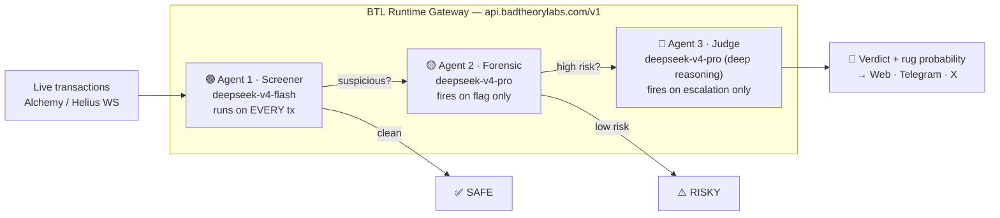
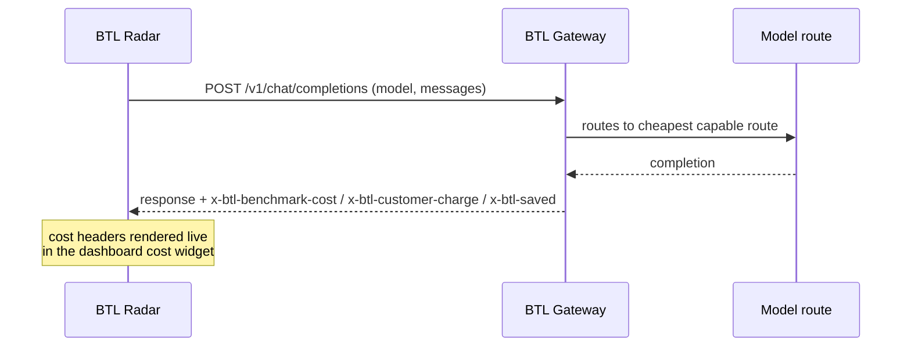

<div align="center">
  

  # BTL Radar

  **Three agents. One gateway. Zero rugs.**

  Real-time token security intelligence built on the [BTL Runtime](https://runtime.badtheorylabs.com).
  Paste any EVM or Solana contract address and watch three cascading AI agents screen transactions,
  reason about anomalies, and deliver a plain-English verdict — before you lose money.

  
  
  
  

  Built for the **BTL Runtime Hackathon** · July 3–5, 2026

</div>

---

## How it works

You paste a contract address. The radar starts immediately. Every transaction flows through a
three-tier agent cascade — each tier routed through the BTL gateway, each tier more expensive
than the last, and each tier firing **only when the one below escalates**.



| Agent | Job | Model (via BTL) | Fires |
|---|---|---|---|
| 🟢 **Screener** | Flag volume spikes, dev-wallet moves, liquidity shifts, gas anomalies | `deepseek-v4-flash` | Every transaction batch |
| 🟡 **Forensic** | Wallet history, deployer identity, known rug-pattern matching | `deepseek-v4-pro` | Only when Agent 1 flags |
| 🔴 **Judge** | Plain-English verdict + rug probability score + alert copy | `deepseek-v4-pro` deep-reasoning pass | Only when Agent 2 confirms high risk |

The scan pipeline lives in [`src/app/api/scan/route.ts`](src/app/api/scan/route.ts); the single
BTL client every agent goes through is [`src/lib/btl.ts`](src/lib/btl.ts).

---

## Why the BTL Runtime is the product

This architecture is **economically impossible without a routing gateway**.

The screener processes thousands of transactions per session. On a single frontier model that's
hundreds of dollars a day. BTL routes each tier to the cheapest capable model, and the expensive
reasoning pass only runs on genuine escalations:



Every BTL response carries `x-btl-benchmark-cost`, `x-btl-customer-charge`, and `x-btl-saved`
headers. The dashboard's **cost widget** surfaces them on every single scan — the savings aren't
an abstraction, they're printed next to the verdict. When a grant-covered route reports $0, the
app computes the benchmark from real token usage at GPT-4o list pricing so the comparison stays
honest.

Typical full cascade (screen → forensics → verdict): **~$0.014 benchmark vs $0.000 actual.**

---

## Screenshots

<!-- Drop screenshots/GIFs here after recording the demo:


-->
*Run `npm run dev` and open `/app?demo=true` for the guided demo experience.*

---

## Distribution — one radar, three surfaces

| Surface | Handle | How it works |
|---|---|---|
| 🌐 Web app | [btl-radar.vercel.app](https://btl-radar.vercel.app) | Full three-column radar with live transaction feed and cost widget |
| ✈️ Telegram | `@BTLRadarBot` | DM or add to any group — it scans every contract address posted ([`telegram-bot/`](telegram-bot/)) |
| 𝕏 X | `@BTLRadar` | Mention it under any thread with a CA — replies with the verdict ([`x-bot/`](x-bot/)) |

Both bots are thin clients: they detect the address, call the same `/api/scan` pipeline, and
format the verdict for their platform. One brain, three mouths.

---

## Chains supported

- **EVM** — Ethereum, Base, BSC, Arbitrum (Alchemy WebSocket)
- **Solana** — all SPL tokens (Helius WebSocket)

---

## Quick start

```bash
git clone https://github.com/TheWeirdDee/BtlRadar
cd BtlRadar
npm install
cp .env.example .env.local   # fill in your keys
npm run dev                  # http://localhost:3000 (or next free port)
```

Then open **`/app?demo=true`** for the guided demo (mock feed, no API usage), or **`/app`** and
paste a real contract address for a live three-agent scan.

### Environment variables

| Variable | Purpose |
|---|---|
| `BTL_API_KEY` | BTL Runtime key — create at the [dashboard](https://runtime.badtheorylabs.com) |
| `NEXT_PUBLIC_SUPABASE_URL` / `SUPABASE_SERVICE_KEY` | Scan memory (persists verdict history per contract) |
| `ALCHEMY_API_KEY` | EVM transaction feed |
| `HELIUS_API_KEY` | Solana transaction feed |
| `TELEGRAM_BOT_TOKEN` | Telegram bot (see `telegram-bot/.env.example`) |
| `X_API_KEY` … `X_BEARER_TOKEN` | X bot (see `x-bot/.env.example`) |

### Run the Telegram bot

```bash
cd telegram-bot
npm install
cp .env.example .env   # bot token from @BotFather + URL of the running web app
npm run dev
```

### Run the X bot

```bash
cd x-bot
npm install
cp .env.example .env   # X API v2 credentials + URL of the running web app
npm run dev            # polls mentions every 60s
```

---

## Project structure

```
├── src/
│   ├── app/
│   │   ├── page.tsx              # Landing page
│   │   ├── app/                  # Radar dashboard
│   │   └── api/scan/route.ts     # Three-agent cascade pipeline
│   ├── components/               # Radar columns, verdict box, cost widget…
│   └── lib/
│       ├── btl.ts                # BTL Runtime client (all agent calls)
│       ├── alchemy.ts helius.ts  # Chain data feeds
│       └── memory.ts             # Supabase scan memory
├── telegram-bot/                 # Telegraf bot → /api/scan
├── x-bot/                        # X API v2 bot → /api/scan
└── data/schema.sql               # Supabase schema
```

---

## Hackathon submission

- **Event:** BTL Runtime Hackathon, July 3–5 2026
- **BTL endpoint used:** `/v1/chat/completions` (OpenAI-compatible) — every agent call in the app
- **Runtime features exercised:** multi-tier model routing, per-request cost headers
  (`x-btl-benchmark-cost` / `x-btl-customer-charge` / `x-btl-saved`), DeepSeek direct routes
- **Team:** Divine ([@TheWeirdDee](https://github.com/TheWeirdDee)) — solo build

---

<div align="center">
  Built by Divine (<a href="https://github.com/TheWeirdDee">@TheWeirdDee</a>) · Powered by <a href="https://runtime.badtheorylabs.com">BTL Runtime</a>
</div>
